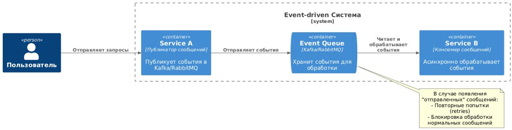
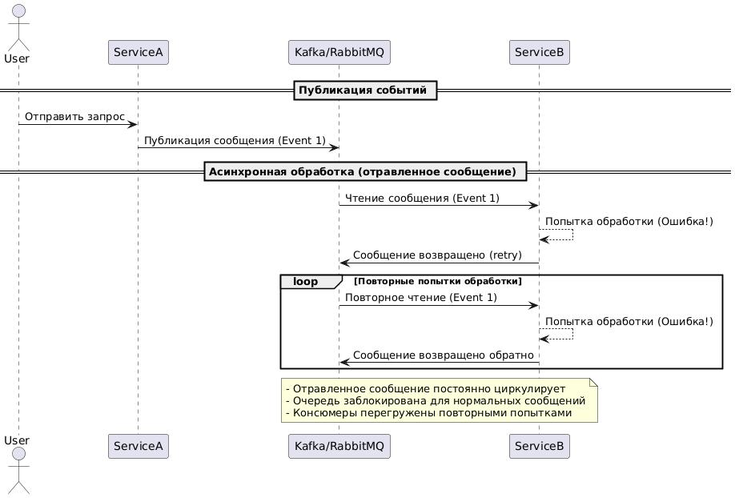

# Защита консюмеров очередей событий от "ядовитых" (poison) сообщений
 

## Сценарий:
Компания использует event-driven архитектуру. Сервис A публикует сообщения в очередь (Kafka/RabbitMQ), сервис B асинхронно читает и обрабатывает эти сообщения. Из-за ошибки сериализации или некорректного формата данных, некоторые сообщения ("poison events") не могут быть обработаны сервисом B, вызывая повторные ошибки обработки и повторные попытки чтения.
<!-- more -->

## Проблема:
- Застревание очереди: Poison сообщения бесконечно возвращаются в очередь, блокируя нормальные события.
- Высокая нагрузка: повторные попытки обработки (retries) перегружают сервис B и снижают производительность системы.
- Потеря данных: нормальные сообщения задерживаются или теряются из-за постоянной обработки проблемных событий.
- Отсутствие диагностики: невозможно оперативно понять, какие сообщения и почему вызывают сбой.

## Вопрос:
Как архитектурно защитить сервис B от poison-сообщений и обеспечить стабильную обработку нормальных сообщений, одновременно упрощая диагностику и обработку проблемных событий?

## Варианты решения:
A) Ограничить число retries для каждого сообщения, после превышения порога автоматически отправлять сообщение в отдельную Dead-Letter Queue (DLQ). Сервис поддержки регулярно проверяет DLQ и разбирается с проблемными сообщениями отдельно.
B) При возникновении ошибок сериализации сразу останавливать всю обработку и ставить сервис B на паузу до исправления проблемы, чтобы не усугублять ситуацию дополнительными попытками.
C) Полностью отключить retries и отбрасывать любое сообщение, которое не удалось обработать с первой попытки.
D) Отправлять проблемные сообщения обратно в основную очередь с небольшим таймаутом, давая возможность сервису B обработать их позже без дополнительных механизмов.

